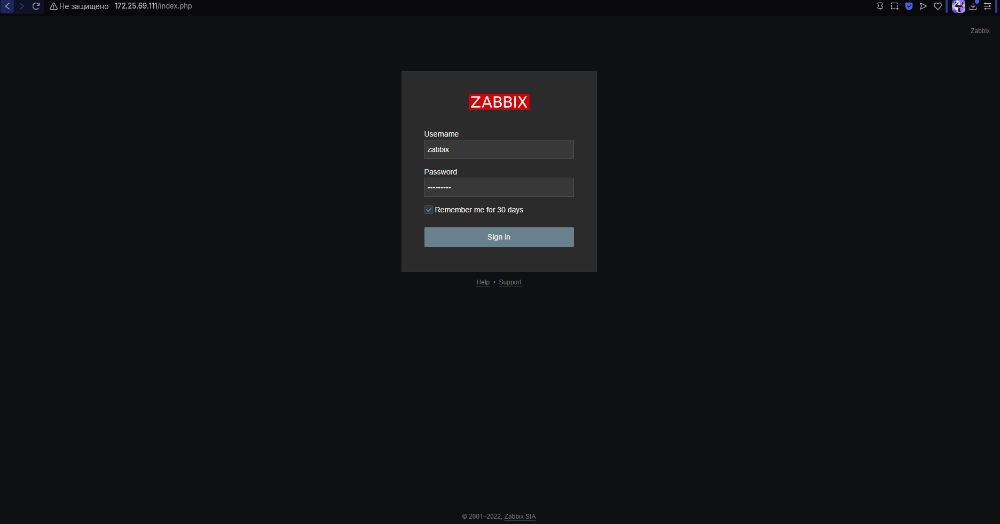
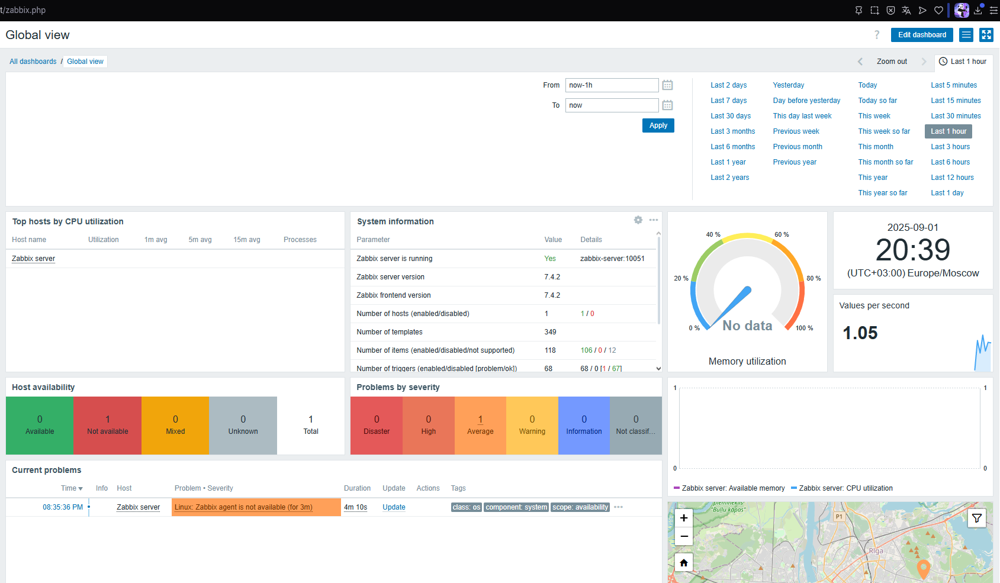

# Домашнее задание к занятию "`Система мониторинга Zabbix`" - `Белолипецкий Леонид`


### Задание 1

```bash
sudo apt install postgresq
wget https://repo.zabbix.com/zabbix/6.0/ubuntu/pool/main/z/zabbix-release/zabbix-release_6.0-4+ubuntu22.04_all.deb
sudo dpkg -i zabbix-release_6.0-4+ubuntu22.04_all.deb
sudo apt update
sudo apt install zabbix-server-pgsql zabbix-frontend-php php7.4-pgsql zabbix-apache-conf zabbix-sql-
scripts nano -y
sudo -u postgres createuser --pwprompt Zabbix
sudo -u postgres createdb -O zabbix zabbix
sudo systemctl restart zabbix-server apache2
sudo systemctl enable zabbix-server apache2

wget https://repo.zabbix.com/zabbix/6.0/ubuntu/pool/main/z/zabbix-release/zabbix-release_6.0-4+ubuntu22.04_all.deb
sudo dpkg -i zabbix-release_6.0-4+ubuntuXX.XX_all.deb
sudo apt install zabbix-agent -y
sudo systemctl restart zabbix-agent
sudo systemctl enable zabbix-agent
```





